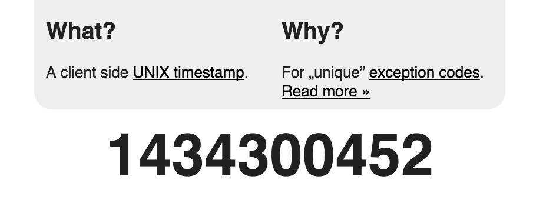

# ExceptionStamp

A unique code / ID for your exceptions.
Demo available at [andygrunwald.github.io/ExceptionStamp](https://andygrunwald.github.io/ExceptionStamp).



## What is it in detail?

Every developer who interacts with [exceptions](https://en.wikipedia.org/wiki/Exception_handling) knows the problem: You need a unique number for your exception to determine it in the whole application. 

A smart concept is to use the [unix timestamp](https://en.wikipedia.org/wiki/Unix_time) at the time of implementation of the exception as a application wide unique number. 
This is used by some open source projects e.g. [TYPO3](http://typo3.org/) and [FLOW](http://flow.typo3.org/).
[Robert Lemke](https://twitter.com/robertlemke) described this concept in a blog post: [Exceptional usefulness](http://buzz.typo3.org/people/robert-lemke/article/exceptional-usefulness/).

## Why you created this?

Because every time i need a timestamp i created a single file which returns the current time as one number. 
Every time i waste time for the same thing. 
To do the same could be boring ;) 
And of course is this a little finger exercise and playground for myself to try [JQuery](http://jquery.com/) and [HTML5Boilerplate](http://html5boilerplate.com/).

## Why a client side timestamp?

To create the possibility to use it [offline](http://exceptionstamp.andygrunwald.com/download/exceptionStamp.zip) and without a webserver.

## Are there alternative ways?

Yes of course.
There are 1000 ways out there to reach this goal.
Some of them are ...

### Use PHP

```sh
$ php -r 'echo time();'
```

### Use bash

```sh
$ date +%s
```

### Alfred app on Mac

See [mwaterfall/alfred-datetime-format-converter](https://github.com/mwaterfall/alfred-datetime-format-converter).

## Who built it?

Andy Grunwald, [andygrunwald.com](http://andygrunwald.com)

## License

This project is released under the terms of the [MIT license](http://en.wikipedia.org/wiki/MIT_License).